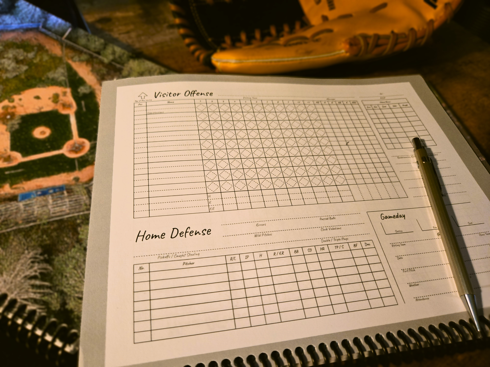

# The Dirty Eraser

This is the baseball scorecard design I've been chipping away at for the past few years in glorious drawio format.

  

## Printable items

The 'printable' directory contains the following items:
- single_game.pdf: A two-page PDF that you can use for a test run to score a single game. I developed and tested the scorecard by printing such a document off at the local Kinkos on my way to the game.
- Six other PDFs that, when combined, turn into the full book I printed out for myself. I'm fond of how the inside cover works, but you may want to replace the outside cover art or modify how many games go into your book.

## License

This scorecard design is licensed under the [Creative Commons Attribution-NonCommercial 4.0 International License](https://creativecommons.org/licenses/by-nc/4.0/).
